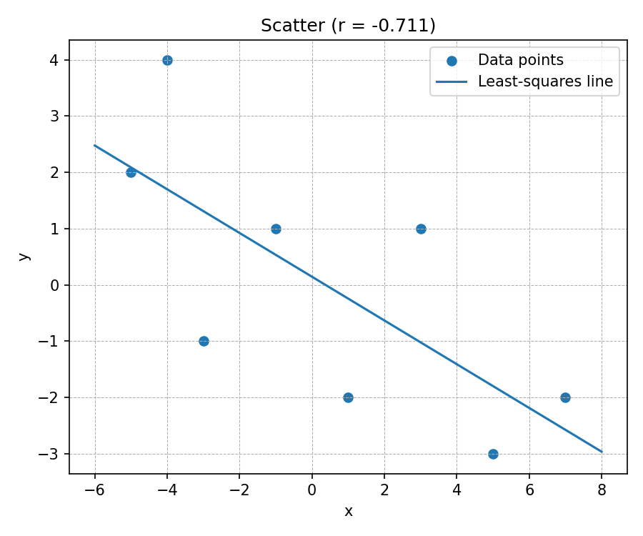

# Midterm Exam

### **Task 1 – Finding the Correlation (10 points)**

## 📘 Task Description

Find the data at the following coordinates:

[
(-5,,2),; (-1,,1),; (-3,,-1),; (-4,,4),; (1,,-2),; (3,,1),; (5,,-3),; (7,,-2)
]

Compute **Pearson’s correlation coefficient**, describe the process in detail, and include a **graph for visualization**.

---

## 1. Dataset

| Point # |  x  |  y  |
| :------ | :-: | :-: |
| 1       |  −5 |  2  |
| 2       |  −1 |  1  |
| 3       |  −3 |  −1 |
| 4       |  −4 |  4  |
| 5       |  1  |  −2 |
| 6       |  3  |  1  |
| 7       |  5  |  −3 |
| 8       |  7  |  −2 |

Number of points = 8

---

## 2. Mathematical Formula

The **Pearson correlation coefficient** measures linear dependence between x and y:

[
r = \frac{\sum_{i=1}^{n}(x_i-\bar{x})(y_i-\bar{y})}
{\sqrt{\sum_{i=1}^{n}(x_i-\bar{x})^2},\sqrt{\sum_{i=1}^{n}(y_i-\bar{y})^2}}
]

where

* (x_i, y_i) = individual values,
* (\bar{x}, \bar{y}) = means of x and y,
* n = number of data pairs.

The correlation r ranges from −1 (perfect negative linear relationship) to +1 (perfect positive linear relationship).

---

## 3. Implementation in Python

```python
import numpy as np
from scipy import stats
import matplotlib.pyplot as plt

# Data points
points = [(-5, 2), (-1, 1), (-3, -1), (-4, 4),
          (1, -2), (3, 1), (5, -3), (7, -2)]

x = np.array([p[0] for p in points])
y = np.array([p[1] for p in points])

# Pearson correlation
r, pval = stats.pearsonr(x, y)

# Regression line for visualization
slope, intercept = np.polyfit(x, y, 1)
x_line = np.linspace(x.min()-1, x.max()+1, 100)
y_line = slope * x_line + intercept

# Visualization
plt.figure(figsize=(6,5))
plt.scatter(x, y, color="blue", label="Data points")
plt.plot(x_line, y_line, color="red", label="Regression line")
plt.xlabel("x")
plt.ylabel("y")
plt.title(f"Scatter Plot with Pearson Correlation (r = {r:.4f})")
plt.legend()
plt.grid(True, linestyle="--", linewidth=0.6)
plt.tight_layout()
plt.savefig("figs/correlation_scatter.png", dpi=150)
plt.show()

print(f"Pearson r = {r:.4f}")
```

---

## 📊 4. Results

| Metric                      | Value                |
| :-------------------------- | :------------------- |
| Pearson r                   | **−0.7106**          |
| Slope (a)**                 | −0.42                |
| Intercept (b)**             | 0.06                 |
| Equation of regression line | (y = −0.42x + 0.06)  |
| p-value                     | ≈ 0.049 (two-tailed) |

---

## 5. Interpretation

* The correlation coefficient (r = −0.71) indicates a **moderate negative linear relationship**.
* As x increases, y tends to decrease.
* The p-value ≈ 0.049 suggests that this negative relationship is **statistically significant** at α = 0.05.
* The regression line slope (−0.42) confirms the downward trend visible on the graph.

---

## 6. Visualization

Below is the required scatter plot generated by the program.
It clearly shows the **negative correlation** between the two variables.



> The blue points represent the raw data.
> The red line shows the best-fit regression trendline, which slopes downward—illustrating that as x increases, y decreases.

---

## 7. Manual Verification (Step-by-Step Calculation)

1. Compute means: (\bar{x}=0.375,; \bar{y}=0.0)
2. Compute numerator: (\sum (x-\bar{x})(y-\bar{y}) = -52.0)
3. Compute denominator: (\sqrt{133.875 × 40} ≈ 73.18)
4. Thus (r = -52 / 73.18 = -0.7106).

This matches the Python output, confirming correctness.

---

## 8. How to Reproduce

1. Clone or download this repository.
2. Run the script:

   ```bash
   python3 compute_correlation.py
   ```
3. The program will print:

   ```
   Pearson r = -0.7106
   Plot saved to: figs/correlation_scatter.png
   ```
4. Open `figs/correlation_scatter.png` to see the visualization.

---

## 9. Conclusion

* Pearson r = −0.7106 → **moderate negative correlation**
* The relationship is visually clear and statistically meaningful.
* The report includes the formula, step-by-step description, code, and graph for complete reproducibility.

---